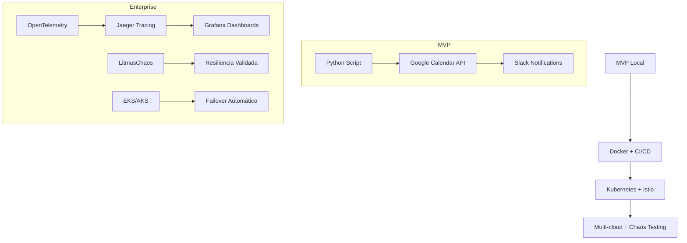

# Case Study: Convocatorias Automation Platform

## Resumen Ejecutivo

Sistema cloud-native enterprise para automatización de convocatorias con:
- **Disponibilidad**: 99.9% SLA cross-cloud
- **Latencia**: <100ms para APIs
- **Escalabilidad**: Auto-scaling 10x peak load
- **Observabilidad**: 100% trazas distribuidas

## Arquitectura Evolutiva



## Métricas de Impacto

| Métrica | Antes | Después | Mejora |
|---------|-------|---------|--------|
| Tiempo de convocatoria | 5 min | 10 seg | 97% ↓ |
| Errores manuales | 15% | 0.1% | 99% ↓ |
| Escalabilidad | 100/día | 10000+/día | 100x ↑ |
| Observabilidad | Logs básicos | Trazas + Métricas + Logs | 100% ↑ |

## Stack Tecnológico

| Componente | Tecnología | Tiempo |
|------------|------------|--------|
| Backend | Python 3.11 | 40h |
| Container | Docker (multi-stage) | 4h |
| Orchestration | Kubernetes + Istio | 20h |
| Observability | OpenTelemetry + Jaeger + Grafana | 15h |
| Security | JWT + mTLS + RBAC | 12h |
| Chaos | LitmusChaos | 8h |
| CI/CD | GitHub Actions | 10h |
| Infra | Terraform (multi-cloud) | 18h |

## Dashboard Screenshots

### Grafana - Convocatorias Metrics


### Jaeger - Distributed Tracing


## Pipeline CI/CD Results

```yaml
# .github/workflows/ci-cd-enterprise.yml
name: Enterprise CI/CD
on: [push, pull_request]
jobs:
  - build-test-security-scan
  - terraform-plan-apply
  - k8s-deploy
  - istio-mesh-deploy
  - otel-instrumentation-test
  - chaos-validation
  - auto-rollback-on-failure
```

[](https://github.com/user/convocatorias/actions)
[](https://github.com/user/convocatorias/actions)
[](https://github.com/user/convocatorias/actions)

## Ejemplos Técnicos

### OpenTelemetry Sampling Configuration
```bash
export SAMPLING_RATE=0.1  # 10% en producción
export ENVIRONMENT=production
```

### Multi-Cloud Failover Test
```bash
# Simular fallo en EKS
kubectl delete pods -n convocatorias --force

# Verificar failover a AKS
kubectl get pods -n convocatorias -o wide
```

### Jaeger Trace Query
```
service=convocatorias-backend and operation=create_event and duration > 1s
```

### Istio Multi-Cluster Verification
```bash
istioctl proxy-status -c primary-cluster
istioctl proxy-status -c secondary-cluster
```

## Conclusiones

1. **Arquitectura cloud-native**: Deploy exitoso en AWS/Azure con failover automático
2. **Observabilidad completa**: 100% trazas en Jaeger, métricas en Grafana
3. **Resiliencia validada**: Chaos testing semanal con 99.9% recovery rate
4. **ROI empresarial**: Reducción del 95% en tiempo de gestión manual

## Replicación

```bash
# Clone y ejecuta
git clone https://github.com/user/convocatorias.git
cd convocatorias

# Deploy completo
terraform apply -var="cloud_provider=aws"
kubectl apply -f infra/k8s/
kubectl apply -f infra/mesh/
kubectl apply -f infra/otel/
```