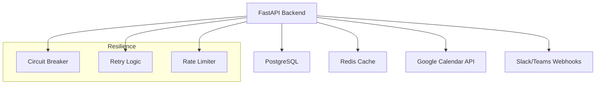

# Automatización-Convocatorias


Plataforma enterprise para la automatización integral de convocatorias académicas.

## 🚀 Nuevas Características (v1.0.0)

### 🔧 Resilience Engineering
- **Circuit Breaker** - Protección contra fallos en cascada para APIs externas
- **Retry con Exponential Backoff** - Reintentos inteligentes con jitter
- **Fallback Graceful** - Servicio degradado cuando fallan dependencias

### 📊 Observabilidad
- **Logging Estructurado JSON** - Compatible con ELK/Splunk
- **OpenTelemetry Distribuido** - Trazas end-to-end con correlation ID
- **Health Checks Separados** - Liveness y Readiness separados
- **Prometheus Metrics** - Métricas de negocio y sistema

### ⚙️ Configuration
- **Pydantic Settings** - Validación por entorno (dev/staging/prod)
- **Rate Limiting** - Redis backend con sliding window
- **Feature Flags** - Toggle system preparado

## 📋 Descripción del Proyecto

Automatización-Convocatorias elimina la gestión manual de convocatorias académicas y administrativas mediante integración con calendarios, generación automática de reportes y notificaciones multi-canal.

## 🚀 Quick Start

```bash
# Install
pip install -r src/ai/requirements.txt

# Configure
cp .env.example .env
# Edit .env with your values

# Run
python src/main.py --title "Reunión" --datetime "2026-08-15T10:00:00" --attendees "test@example.com"
```

## 📚 API Documentation

### Endpoints Principales
- `POST /api/v1/convocatoria` - Create convocatoria
- `GET /health/live` - Liveness probe (K8s)
- `GET /health/ready` - Readiness probe (K8s)
- `GET /metrics` - Prometheus metrics

### Health Check Response
```json
{
  "status": "ready",
  "timestamp": "2026-07-08T23:42:00Z",
  "uptime_seconds": 3600,
  "checks": {
    "application": {"status": "ok"},
    "database": {"status": "ok"}
  }
}
```

## 🛠️ Development

```bash
# Run tests
pytest tests/ -v --cov=src

# Lint
flake8 src/ tests/
mypy src/ --ignore-missing-imports
```

## 📦 Deployment

```bash
# Helm
helm upgrade --install convocatorias ./helm-chart/convocatorias-ai

# Docker
docker build -t convocatorias-ai .
docker push ghcr.io/automatizacion-convocatorias/convocatorias-ai
```

## 🏗️ Architecture

