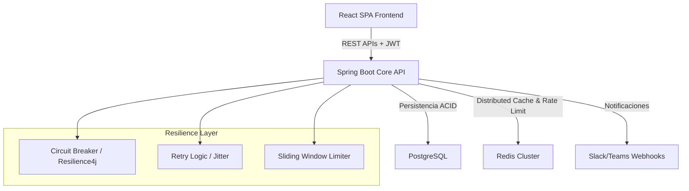

# Automatización de Convocatorias 🚀
### Sistema Empresarial Core para Gestión y Procesamiento de Convocatorias

<p align="left">
  
  
  
  
  
  
</p>


Plataforma corporativa de nivel *enterprise* para la automatización integral, gestión y procesamiento distribuido de convocatorias académicas y administrativas.

---

## 🚀 Características Avanzadas (v1.0.0)

### 🔧 Resilience Engineering
* **Circuit Breaker & Rate Limiting:** Implementación de patrones de tolerancia a fallos mediante mecanismos de Redis con ventana deslizante (*sliding window*) para mitigar caídas en cascada ante APIs de terceros.
* **Resilient Retry Framework:** Políticas de reintentos inteligentes con retroceso exponencial (*exponential backoff*) y fluctuación (*jitter*) para la integración con servicios de mensajería externos.
* **Graceful Fallback:** Degradación controlada del servicio que garantiza la disponibilidad de las consultas de convocatorias aun si los sistemas de notificación colapsan.

### 📊 Observabilidad y Producción
* **Logging Estructurado JSON:** Trazabilidad estandarizada compatible con ecosistemas centralizados de análisis de logs (ELK / Splunk).
* **Distributed Telemetry:** Propagación de identificadores de correlación (*Correlation IDs*) para auditorías transversales extremo a extremo.
* **Probes de Orquestación:** Interfaces explícitas diferenciadas para métricas de ciclo de vida en Kubernetes (*Liveness* y *Readiness*).

---

## 📋 Descripción del Proyecto
Este sistema es una solución empresarial de alta concurrencia diseñada para **eliminar el procesamiento manual y la gestión ineficiente de convocatorias**. La plataforma centraliza el ciclo de vida completo de una postulación: desde la parametrización de bases, control transaccional de expedientes en entornos relacionales, hasta la integración asíncrona con pasarelas de notificación multi-canal (Slack, Teams, Email) y calendarios corporativos.

---

## 🏗️ Arquitectura y Patrones de Diseño
El backend está construido bajo los principios de **Clean Architecture y Arquitectura Hexagonal**, encapsulando las reglas de negocio puras lejos de la infraestructura tecnológica.



### Decisiones de Arquitectura Senior:
* **Desacoplamiento Estricto:** Capa de dominio pura libre de dependencias o anotaciones de persistencia relacional. Traspaso de datos mediante Mappers de alto rendimiento.
* **Control de Errores RFC 7807:** Manejo centralizado de excepciones con `@ControllerAdvice` que devuelve respuestas semánticas estandarizadas (*Problem Details*).

---

## 🛠️ Stack Tecnológico

| Capa / Componente | Tecnología | Propósito Técnico |
| :--- | :--- | :--- |
| **Backend Core** | Java 17 / Spring Boot 3.x | Uso nativo de Records, patrones de coincidencia avanzados y optimización de la JVM. |
| **Resiliencia** | Resilience4j / Redis | Aislamiento de fallos, tolerancia y cuotas de peticiones controladas por IP/Usuario. |
| **Persistencia** | PostgreSQL / JPA / Hibernate | Almacenamiento seguro, transaccional y relacional compatible con el estándar ACID. |
| **Monitoreo** | Spring Actuator + Prometheus | Instrumentación integrada para raspado (*scraping*) continuo de métricas en tiempo real. |

---

## ⚙️ Guía de Despliegue Rápido (Quick Start)

### Requisitos previos:
* [Docker Desktop](https://docker.com) instalado y en ejecución.

### Instrucciones de ejecución:
1. Clonar el repositorio y acceder al directorio raíz:
   ```bash
   git clone https://github.com
   cd automatizacion-convocatorias
   ```
2. Configurar variables de entorno iniciales:
   ```bash
   cp .env.example .env
   # Edite el archivo .env con sus credenciales de base de datos y llaves JWT
   ```
3. Orquestar y levantar el ecosistema completo (Contenedores en segundo plano):
   ```bash
   docker-compose up --build -d
   ```

*La API transaccional estará disponible de inmediato en `http://localhost:8080`.*

---

## 📚 Documentación de APIs & Calidad

### Endpoints de Infraestructura y Negocio
* `POST /api/v1/convocatoria` - Creación y parametrización de nuevas bases de concurso.
* `GET /actuator/health/liveness` - Estado de ejecución del hilo principal del servidor de aplicaciones.
* `GET /actuator/health/readiness` - Estado de la conectividad aguas abajo con PostgreSQL y bases distribuidas en Redis.
* `GET /actuator/prometheus` - Exposición de telemetría de recolección de basura e hilos activos de Tomcat.

### Estructura de Respuesta de Salud (Health Check)
```json
{
  "status": "UP",
  "components": {
    "db": {
      "status": "UP",
      "details": {
        "database": "PostgreSQL",
        "validationQuery": "isValid()"
      }
    },
    "redis": {
      "status": "UP",
      "details": {
        "version": "7.2"
      }
    }
  }
}
```

### Estrategia de Pruebas Automáticas
Aseguramos la integridad de las reglas de negocio a través de una suite rigurosa de control de calidad integrada en el pipeline de CI/CD:
```bash
# Ejecución automatizada de pruebas unitarias y de integración
mvn clean test

# Verificación estática de calidad de código y cobertura
mvn jacoco:report
```
---

