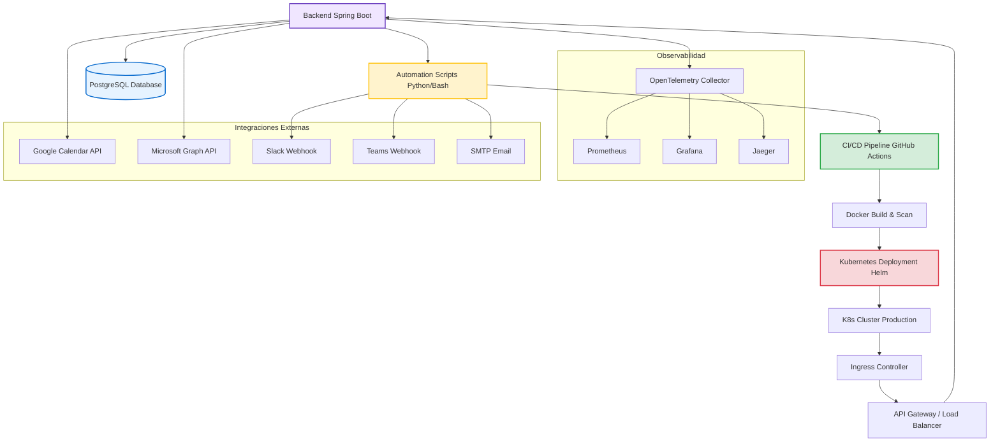
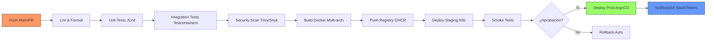

# Automatización-Convocatorias


Plataforma enterprise para la automatización integral de convocatorias académicas. Gestiona la creación, distribución y seguimiento de convocatorias mediante integración con calendarios (Google/Outlook), generación automática de reportes y notificaciones multi-canal (Email, Slack, Teams).

## 📌 Descripción del Proyecto

Automatización-Convocatorias es un sistema empresarial que elimina la gestión manual de convocatorias académicas y administrativas. El sistema orquesta la creación de eventos en calendarios corporativos, genera reportes personalizados con plantillas dinámicas y distribuye notificaciones por múltiples canales, todo ello con arquitectura cloud-native, observabilidad completa y despliegue containerizado.

**Alcance:** Convocatorias académicas, reuniones de comités, procesos de selección, eventos institucionales y cualquier flujo que requiera coordinación temporal y notificación masiva.

---

## ⚙️ Arquitectura



---

## 🛠 Stack Tecnológico

| Capa | Tecnología |
|------|------------|
| **Backend** | Java 17, Spring Boot 3.2 (Web, Data JPA, Security, Validation) |
| **Base de Datos** | PostgreSQL 15 + HikariCP Connection Pool |
| **Automatización** | Python 3.11, Bash para scripts de integración |
| **Mensajería** | Apache Kafka (eventos asíncronos) |
| **Containerización** | Docker 24+, Multi-stage builds |
| **Orquestación** | Kubernetes 1.28+, Helm 3.x |
| **Service Mesh** | Istio 1.20 (mTLS, Traffic Management) |
| **CI/CD** | GitHub Actions (Build, Test, Security Scan, Deploy) |
| **Observabilidad** | OpenTelemetry, Prometheus, Grafana, Jaeger, Loki |
| **Seguridad** | OAuth2/OpenID Connect, JWT, HashiCorp Vault |
| **Testing** | JUnit 5, Mockito, Testcontainers, Cucumber, Pact |
| **IaC** | Terraform 1.6+ (AWS EKS, Azure AKS, GCP GKE) |
| **Frontend (Opcional)** | React 18 + TypeScript + Material-UI |

---

## 🚀 Características Principales

- **🔄 Automatización End-to-End**: Desde la creación de la convocatoria hasta la confirmación de asistencia
- **📅 Integración Multi-Calendario**: Google Calendar y Microsoft Outlook/Graph API
- **📊 Reportes Dinámicos**: Plantillas Jinja2/Thymeleaf con exportación PDF/Excel
- **🔔 Notificaciones Multi-Canal**: Email (SMTP), Slack, Microsoft Teams, Webhooks personalizados
- **☁️ Cloud-Native**: Diseñado para Kubernetes con auto-escalado horizontal (HPA)
- **🔒 Seguridad Enterprise**: mTLS con Istio, JWT/OAuth2, secretos en Vault
- **📈 Observabilidad Completa**: Traces distribuidos, métricas, logs centralizados
- **🛡️ Resiliencia**: Circuit breakers, retry policies, chaos engineering validado
- **🔀 GitOps**: ArgoCD para despliegues declarativos y rollback automático

---

## 📦 Instalación Rápida

### Prerrequisitos
- Java 17 JDK, Maven 3.9+
- Docker 24+, kubectl, Helm 3.x
- PostgreSQL 15 (o Docker Compose)
- Node.js 18+ (solo para desarrollo frontend)

### Desarrollo Local
```bash
# 1. Clonar repositorio
git clone https://github.com/tu-usuario/automatizacion-convocatorias.git
cd automatizacion-convocatorias

# 2. Configurar entorno
cp .env.example .env
# Editar .env con credenciales: DB, OAuth2, APIs externas

# 3. Levantar infraestructura local
docker-compose up -d

# 4. Compilar y ejecutar (para desarrollo backend)
./mvnw clean spring-boot:run -Dspring-boot.run.profiles=dev

# 5. Verificar
curl http://localhost:8080/actuator/health
# API Docs: http://localhost:8080/swagger-ui.html
```

### Despliegue con Helm (Producción)
```bash
# Añadir repo Helm
helm repo add convocatorias https://charts.tu-org.com
helm repo update

# Desplegar
helm upgrade --install convocatorias ./helm-chart/convocatorias \
  --namespace convocatorias-prod \
  --create-namespace \
  --set image.tag=v1.0.0 \
  --set replicaCount=3 \
  --set ingress.enabled=true \
  --set monitoring.enabled=true
```

---

## 🔧 Configuración

Variables de entorno principales (ver `.env.example`):

| Variable | Descripción | Requerida |
|----------|-------------|-----------|
| `SPRING_DATASOURCE_URL` | JDBC URL PostgreSQL | Sí |
| `SPRING_DATASOURCE_USERNAME` | Usuario BD | Sí |
| `SPRING_DATASOURCE_PASSWORD` | Contraseña BD | Sí |
| `GOOGLE_CALENDAR_CREDENTIALS` | Path a service account JSON | Sí |
| `MICROSOFT_GRAPH_CLIENT_ID` | App ID Azure AD | Sí |
| `MICROSOFT_GRAPH_CLIENT_SECRET` | Secret Azure AD | Sí |
| `SLACK_WEBHOOK_URL` | Webhook entrante Slack | No |
| `TEAMS_WEBHOOK_URL` | Webhook Teams | No |
| `SMTP_HOST` / `SMTP_PORT` | Servidor correo | No |
| `VAULT_ADDR` / `VAULT_TOKEN` | HashiCorp Vault | Sí (prod) |

---

## 📊 Observabilidad

### Métricas Clave (Prometheus)
```promql
# Throughput de convocatorias
rate(convocatorias_creadas_total[5m])

# Latencia P99 generación
histogram_quantile(0.99, rate(tiempo_generacion_seconds_bucket[5m]))

# Errores integración externa
rate(errores_integracion_total[5m])

# Pool conexiones DB
hikaricp_connections_active / hikaricp_connections_max
```

### Dashboards Grafana
- **Convocatorias Overview**: Throughput, latencia, errores
- **Infraestructura K8s**: Pods, CPU, memoria, HPA
- **Base de Datos**: Conexiones, queries, locks
- **Integraciones Externas**: Tasa éxito/fallo por API

### Trazas Distribuidas (Jaeger)
```bash
kubectl port-forward svc/jaeger-query 16686:16686 -n observability
# Acceder: http://localhost:16686
```

---

## 🔄 Pipeline CI/CD



### Gates de Calidad
- ✅ Cobertura código ≥ 85%
- ✅ SonarQube Quality Gate passed
- ✅ Trivy: 0 vulnerabilidades CRITICAL/HIGH
- ✅ Tests contrato (Pact) passing
- ✅ Dependencias actualizadas (Dependabot)

---

## 📚 Documentación

| Documento | Descripción |
|-----------|-------------|
| [Guía de Implementación](docs/IMPLEMENTATION_GUIDE.md) | Setup completo, configuración, troubleshooting |
| [Arquitectura de Referencia](docs/REFERENCE_ARCHITECTURE.md) | Decisiones técnicas, ADRs, diagramas C4 |
| [Guía de Contribución](CONTRIBUTING.md) | Estándares código, branching, PR process |
| [Políticas de Seguridad](docs/SECURITY.md) | Gestión vulnerabilidades, disclosure |
| [Runbook Operaciones](docs/OPERATIONS_RUNBOOK.md) | Procedimientos on-call, escalation, runbooks |
| [API Reference](docs/API_REFERENCE.md) | OpenAPI/Swagger generado |

---

## ✅ Calidad y Cumplimiento

- **Cobertura**: >85% (unit + integración + contrato)
- **Análisis Estático**: SonarQube Quality Gate en cada PR
- **Seguridad**: Trivy + Snyk + OWASP Dependency Check
- **Pruebas Carga**: k6 scripts en CI (1000 RPS objetivo)
- **Penetración**: Trimestral (proveedor certificado)
- **Cumplimiento**: GDPR, ISO 27001 (en proceso), SOC 2 Type II

---

## 📦 Deployment Manifests

Los siguientes archivos están disponibles para el despliegue:

| Archivo | Descripción | Uso |
|---------|-------------|-----|
| `docker-compose.yml` | Orquestamiento de servicios locales | `docker-compose up -d` |
| `Dockerfile` (cada servicio) | Build multi-stage para cada microservicio | Imágenes Docker |
| `helm-chart/` | Charts Helm para despliegue K8s | `helm install convocatorias ./helm-chart/convocatorias` |

### Despliegue Local
```bash
docker-compose up -d
# Verificar: curl http://localhost:8080/actuator/health
```

### Despliegue Producción
```bash
helm upgrade --install convocatorias ./helm-chart/convocatorias \
  --namespace convocatorias-prod \
  --create-namespace \
  --set image.tag=v1.0.0
```

---

## 🤝 Contribuir

1. Fork del repositorio
2. Crear feature branch (`git checkout -b feature/nueva-funcionalidad`)
3. Commit cambios (`git commit -m 'feat: descripción breve'`)
4. Push branch (`git push origin feature/nueva-funcionalidad`)
5. Abrir Pull Request

Ver [CONTRIBUTING.md](CONTRIBUTING.md) para estándares de código, convenciones de commit (Conventional Commits) y proceso de revisión.

---

## 📄 Licencia

Distribuido bajo licencia MIT. Ver `LICENSE` para más información.

---

## 📞 Soporte

- **Equipo Plataforma**: plataforma@tu-org.com
- **Slack**: `#infra-convocatorias`
- **Escalamiento**: [SUPPORT_GUIDE.md](docs/SUPPORT_GUIDE.md)
- **Issues**: GitHub Issues para bugs y feature requests

---

*Automatización-Convocatorias © 2024-2026 - Construido con estándares enterprise para escalabilidad, seguridad y observabilidad.*