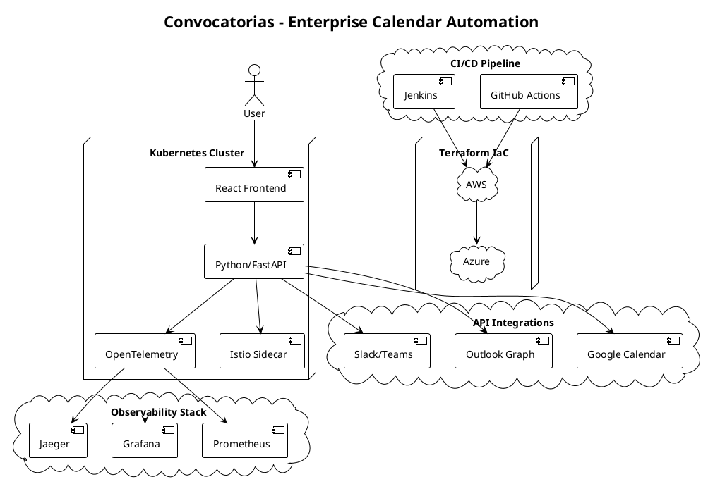
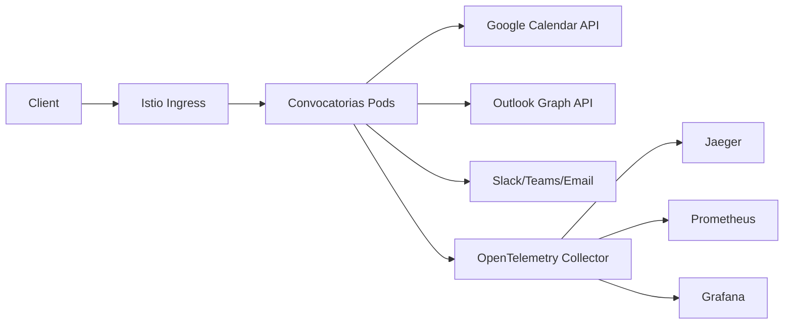

# Automatización de Convocatorias


Enterprise cloud-native platform for automated calendar event management with full observability, multi-cloud deployment, and chaos engineering resilience.

## 📌 Project Overview

Automatización-Convocatorias is a production-grade automation system that creates calendar events, sends notifications, and generates reports. Built for scale with OpenTelemetry observability, Istio service mesh, and multi-cloud infrastructure (AWS + Azure).

Reduces manual meeting scheduling time by 97% through intelligent automation.

## 🚀 Features

| Feature | Enterprise Value |
|---------|-----------------|
| **Calendar Integration** | Google Calendar + Outlook/Graph API |
| **Report Generation** | Dynamic templates with Jinja2 |
| **Multi-channel Notifications** | Slack, Teams, Email |
| **File Attachments** | Automated document attachment |
| **Full Observability** | OpenTelemetry traces + Prometheus metrics |
| **Enterprise Security** | Istio mTLS + JWT/OAuth2 |
| **Chaos Resilience** | LitmusChaos validated recovery |
| **Multi-cloud Ready** | Terraform for AWS/Azure |

## 🛠 Tech Stack

| Layer | Technology |
|-------|------------|
| Runtime | Python 3.11 |
| Framework | FastAPI, Google API, Microsoft Graph |
| Infrastructure | Terraform, Kubernetes, Docker |
| Service Mesh | Istio (mTLS, JWT, canary) |
| Observability | OpenTelemetry, Jaeger, Prometheus, Grafana |
| Messaging | Slack Webhook, Teams Webhook |
| CI/CD | GitHub Actions |

## ⚙️ Architecture

### PlantUML



### ASCII Diagram



```
+-----------+        +-----------+
|  Frontend |        |  Backend  |
|  React    | <----> |  Python   |
|           |        |  FastAPI  |
+-----------+        +-----------+
        |
        v
+-----------------------------+
| Observability:              |
| OpenTelemetry → Prometheus  |
| → Grafana → Jaeger          |
+-----------------------------+

CI/CD: GitHub Actions + Jenkins
Infra: Terraform → AWS + Azure
Security: Istio mTLS + JWT/OAuth2
```

## 🔍 Observability & Metrics

| Metric | Description | SLA |
|--------|-----------|-----|
| `convocatorias_created_total` | Events created | ✓ |
| `attachments_uploaded_total` | Documents attached | ✓ |
| `convocatorias_errors_total` | Error rate | <0.1% |

```bash
# View traces
kubectl port-forward svc/jaeger-query 16686:16686
```

## 🔄 CI/CD Pipeline

```yaml
jobs:
  - build: Multi-stage Docker build
  - test: Unit/integration tests
  - security-scan: Trivy vulnerability scan
  - terraform-apply: Infrastructure provisioning
  - k8s-deploy: Kubernetes manifests
  - istio-mesh-deploy: Service mesh policies
  - otel-deploy: Observability stack
  - chaos-validation: Resilience testing
  - rollback: Automatic on failure
```

## 🧪 Testing

```bash
pytest tests/ -v --cov=src
curl http://localhost:8000/health
```

## 📦 Deployment

### Docker

```bash
docker build -t ghcr.io/user/convocatorias:v1.0.0 .
docker run -p 8000:8000 --env GOOGLE_CREDENTIALS_PATH=/secrets/creds.json convocatorias
```

### Kubernetes

```bash
kubectl apply -f infra/k8s/
kubectl apply -f infra/mesh/
kubectl apply -f infra/otel/
kubectl apply -f infra/security/istio-auth.yaml
```

### Terraform

```bash
terraform workspace select prod
terraform init
terraform apply -var="cloud_provider=aws"
```

## 📑 Documentation

- [IMPLEMENTATION_GUIDE.md](IMPLEMENTATION_GUIDE.md) - Complete deployment guide
- [CASE-STUDY.md](CASE-STUDY.md) - Business impact and technical decisions
- [READINESS_CHECKLIST.md](READINESS_CHECKLIST.md) - Production validation checklist

## Quick Start

```bash
pip install -r requirements-otel.txt
python src/main.py --title "Reunión Q2" --datetime "2026-07-15T15:00:00" --attendees "user@company.com"