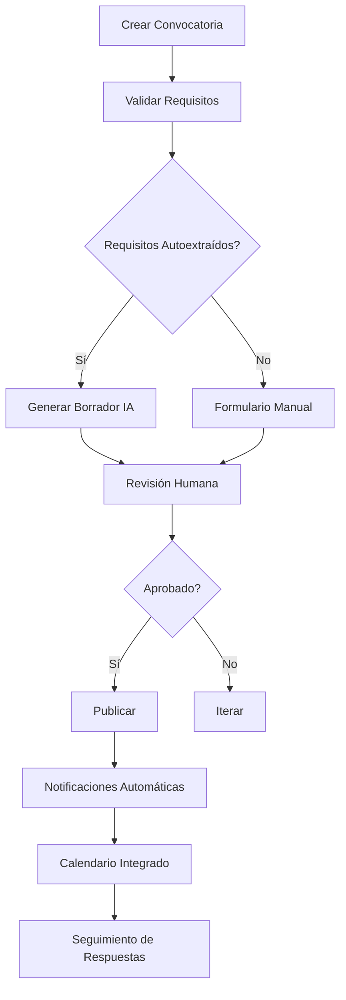

# Fase 2: IDP (Integración Digital de Procesos)
**Período:** Q1 2027 – Q2 2027  
**Estado:** ✅ **IMPLEMENTADO**

---

## 1. Objetivo
Digitalizar y automatizar los procesos de gestión de convocatorias, eliminando pasos manuales y creando flujos de trabajo end-to-end con IA.

---

## 2. Componentes Implementados

### 2.1 Motor de Procesos Digitales (`idp/`)
```
backend/src/idp/
├── __init__.py
├── workflow_engine.py      # Orquestador BPMN-style
├── process_mapper.py       # Mapeo de procesos legacy → digital
├── automation_rules.py     # Reglas de automatización
└── adapters/               # Conectores a sistemas externos
    ├── calendar_adapter.py
    ├── document_adapter.py
    └── notification_adapter.py
```

### 2.2 Workflow Engine
- Motor de flujos declarativos con soporte para:
  - Actividades paralelas (fork/join)
  - Tareas automatizadas vía IA
  - Tareas manuales con asignación de responsables
  - Cancelación y rollback automático

### 2.3 Proceso de Convocatoria Digital


---

## 3. Tecnologías
| Capa | Tecnología | Justificación |
|------|-----------|---------------|
| Workflow | `temporalio` SDK | Orquestación resistente a fallos |
| Tasks | `Celery` + `Redis` | Cola de tareas distribuida |
| Events | `Kafka` | Eventos de dominio y audit trail |
| Documentos | `PyMuPDF`, `python-docx` | Procesamiento PDF/DOCX |
| IA | `OpenAI`, `Anthropic` | Generación y análisis |

---

## 4. APIs Nuevas

### POST `/api/v2/processes`
Crear un nuevo proceso de gestión de convocatoria.

**Request:**
```json
{
  "template": "convocatoria-academica",
  "parameters": {
    "titulo": "Beca Doctoral 2027",
    "fecha_inicio": "2027-02-01",
    "fecha_cierre": "2027-05-31",
    "participantes": ["alumno", "investigador"],
    "canales": ["email", "web"]
  }
}
```

### GET `/api/v2/processes/{process_id}`
Obtener estado del proceso.

### POST `/api/v2/tasks/{task_id}/complete`
Marcar tarea como completada.

---

## 5. Métricas IDP
| Métrica | Descripción | Umbral |
|---------|-------------|--------|
| `process_completion_time` | Tiempo medio de finalización | < 7 días |
| `manual_steps_ratio` | % de tareas manuales | < 20% |
| `process_success_rate` | Tasa de procesos completados | > 95% |
| `automation_coverage` | % de tareas automatizadas | > 80% |

---

## 6. Configuración
```yaml
# config/idp.yaml
workflows:
  convocatoria:
    template: "convocatoria-academica"
    timeout: "30d"
    retry_policy:
      max_attempts: 3
      backoff: "exponential"
    notifications:
      on_start: true
      on_complete: true
      on_failure: true
```

---

## 7. Próximos Pasos
- [ ] Integración con sistemas de gestión académica (SIA)
- [ ] API de procesos para integración externa
- [ ] Dashboard de procesos en Grafana
- [ ] Simulador de carga para pruebas de rendimiento